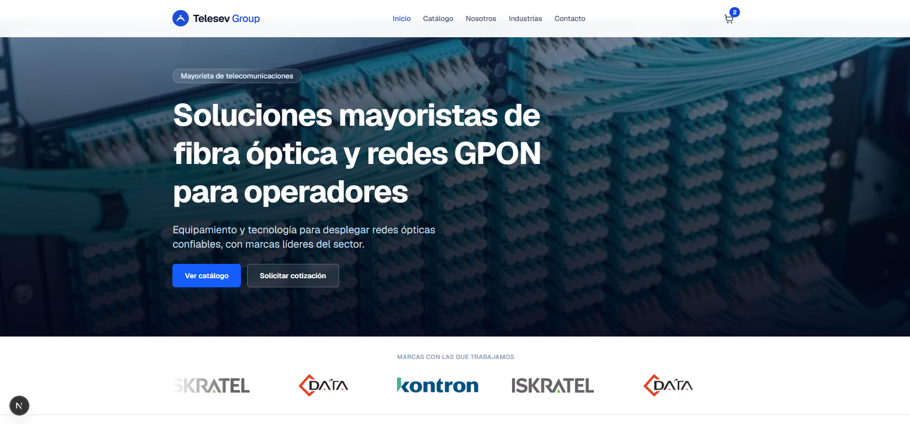
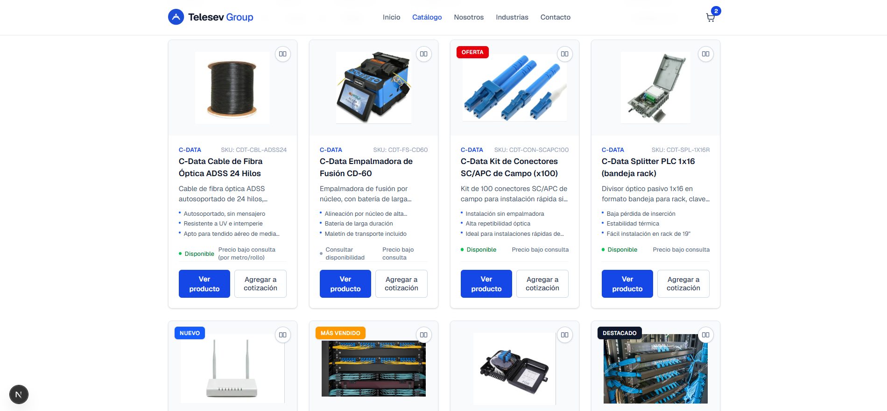
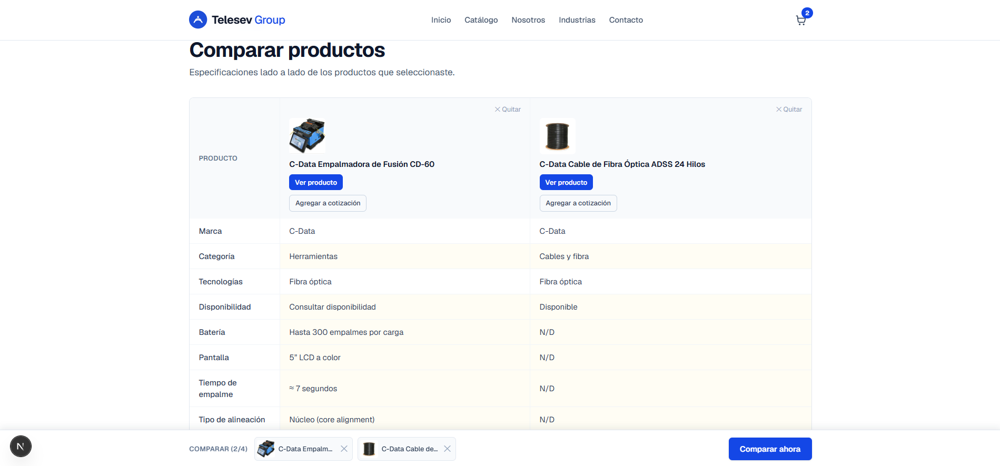

# Telesev Group — B2B Telecom Wholesale Website

Telesev Group is a corporate website designed for a B2B telecommunications wholesaler: a company that doesn't sell to end consumers, but to other operators and integrators who need fiber optic equipment, GPON networks, and optical networking solutions.
The problem it solves is simple but typical of the industry: a technical wholesaler needs to display their catalog clearly, convey professionalism to corporate clients, and above all convert visits into real sales opportunities — whether from someone who wants to be contacted, or someone who already knows what product they're interested in and wants a quote. The site is designed around that funnel: catalog → product → quote, with a general contact channel in parallel, and an internal panel where the sales team reviews incoming leads.

**Live site:** https://telecom-b2b-catalog.vercel.app

## 📸 Screenshots

### Hero Section & Brand Partners
Full-screen hero with background image, gradient overlay, and dual CTAs (View catalog / Request quote). Immediately below: auto-scrolling logo strip of partner brands (Kontron, Iskratel, C-Data) with CSS-only continuous carousel.


### Product Catalog
Searchable and filterable product grid with advanced filters (category, brand, technology, availability), active filter chips, sort options, view toggle (grid/list), and pagination. Built with state synced to the URL via the History API.


### Product Comparison
Side-by-side comparison table for up to 4 products, showing unified specifications across all selected items. Differences are subtly highlighted. Responsive: horizontal scroll on mobile with a sticky first column.


### Admin Dashboard
Protected admin panel (Supabase Auth) with summary metrics (total quotes, new quotes, total contacts, catalog size) and a "Most requested products" chart. Includes full tables for quotes and contacts with status management (New / In progress / Answered / Closed), plus product CRUD.


## Main Features

- **Catalog with filters** — Products can be filtered by brand (Kontron, Iskratel, C-Data) and by technology (GPON, optical networks, fiber optics), so technical visitors find what they need quickly.
- **Product detail pages** — Each product has its own page with commercial and technical specs, dynamically generated from a single data source.
- **Contact form** —  For general inquiries, with Spanish validation and clear submission confirmation.
- **Dynamic quote form** — If a visitor requests a quote from a specific product, the form already knows which product it is (no need to type it); it also supports general quotes without an associated product. Multi-product quote cart included.
- **Protected admin panel** —  The Telesev Group team can log in and view received quotes and contacts in one place, without that information being accessible to anyone else.
## Tech Stack

- **Next.js (App Router) + TypeScript** — Static routes for the catalog and product sheets (fast and SEO-friendly), and dynamic routes where real interactivity is needed (forms, admin panel).
- **Tailwind CSS** — To maintain a consistent visual identity (corporate blue, uniform typography and spacing) without writing CSS by hand in every component.
- **Supabase (Postgres + Auth)** —  Database to store contacts and quotes, and authentication to protect the admin panel, without having to maintain a custom backend.
- **Vercel** — Continuous deployment: every change to the main branch is automatically published.

## Architecture & Design Decisions

- **Catalog data lives in code (`data/products.ts`), not in the database.** It's a curated and stable catalog (brands and technologies from the wholesaler), not content that changes all the time or needs an editing panel — so having it typed in TypeScript is simpler than adding a table and an admin screen just for that.
- **`contacts` and `quotes` tables use Postgres Row Level Security (RLS).** The site's public key (`anon key`) only has permission to insert rows into these tables — never to read them. This is intentional: anyone can submit a form, but no one can use that same public key to snoop on other people's contacts or quotes. Reading is only allowed for authenticated users, which is exactly what the admin panel needs.
- **The admin panel (`/admin`) is not linked from any public menu.** It's accessed by direct URL, validates the session with Supabase Auth as soon as it loads, and if there's no session, redirects to login without ever requesting or showing any data. It's a simple but effective security layer for an area that doesn't need to be discoverable from public navigation.
- **Product pages are statically generated** (`generateStaticParams`), because the catalog doesn't change in real time — so they load fast and don't depend on a query on every visit.

## How to Run Locally

1. Clone the repository:
   ```bash
   git clone https://github.com/Lin4saurus/telecom-b2b-catalog.git
   cd telecom-b2b-catalog
   ```

2. Install dependencies:
   ```bash
   npm install
   ```

3. Create a `.env.local` file in the root of the project with these variables (Supabase values are obtained from your own project, in *Project Settings → API*):
   ```
   NEXT_PUBLIC_SUPABASE_URL=
   NEXT_PUBLIC_SUPABASE_ANON_KEY=

   # Opcionales, solo si querés recibir un email por cada cotización nueva
   RESEND_API_KEY=
   QUOTE_NOTIFICATION_EMAIL=
   QUOTE_NOTIFICATION_FROM=
   QUOTE_WEBHOOK_SECRET=
   ```
   > This file is never uploaded to the repository (it's in `.gitignore`) — everyone uses their own keys.

4. Run the development server:
   ```bash
   npm run dev
   ```
   Open [http://localhost:3000](http://localhost:3000).

For the site to work end-to-end, you also need on the Supabase side: the `contacts` and `quotes` tables created, the RLS policies described above, and a user in Authentication to be able to access the admin panel.

## Deployment

The site is automatically deployed to Vercel with every `git push`  to the main branch. The same environment variables (`NEXT_PUBLIC_SUPABASE_URL` and `NEXT_PUBLIC_SUPABASE_ANON_KEY`) are configured in the Vercel project.

🌐 [Read this in Spanish](README.es.md) | [Leer en español]